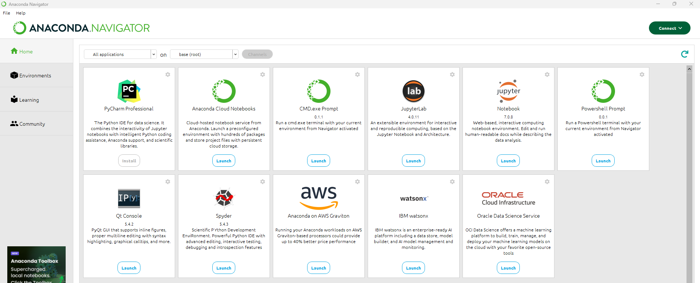

# Flask伺服器建置與開發
- 本地端Flask
- 雲端平台
  - [render](https://render.com/)
  - [replit](https://replit.com/)

## 本地端Flask
- Windows
- 安裝Anaconda [CONDA指令](https://github.com/MyDearGreatTeacher/2024A2/blob/main/conda-cheatsheet.pdf)
  - conda env list
  - conda list  [看看裝了甚麼](conda_list.md) 

- 步驟一 : 安裝 Flask 套件== >
  - 安裝好Anaconda後就已經裝了flask
  - 若沒有安裝flask
    - conda install flask
    - 可以使用 pip install flask
- 步驟二 : 撰寫程式 app.py (使用notepad++)
```
from flask import Flask
app = Flask(__name__)
@app.route("/")
def hello():
    return "Hello, World!"
```
- 步驟三 : 終端機指令執行 $ flask run
- 步驟四 : 打開瀏覽器 
- 資料來源: https://devs.tw/post/448
