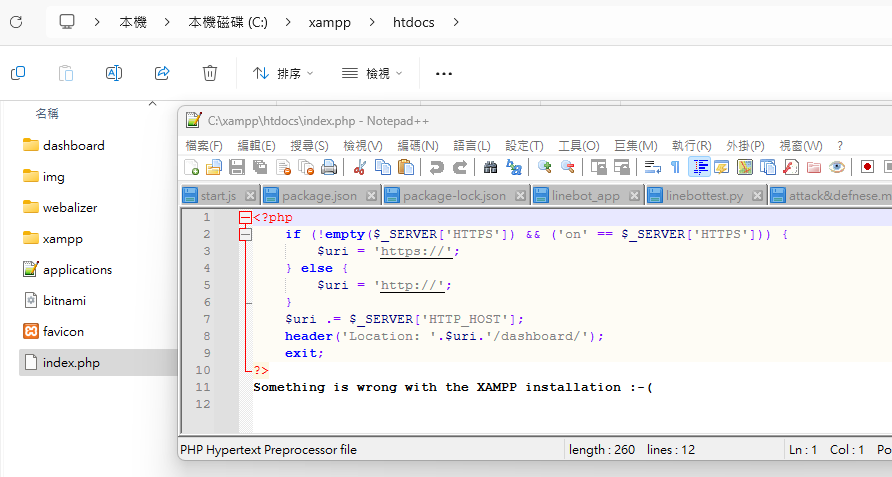
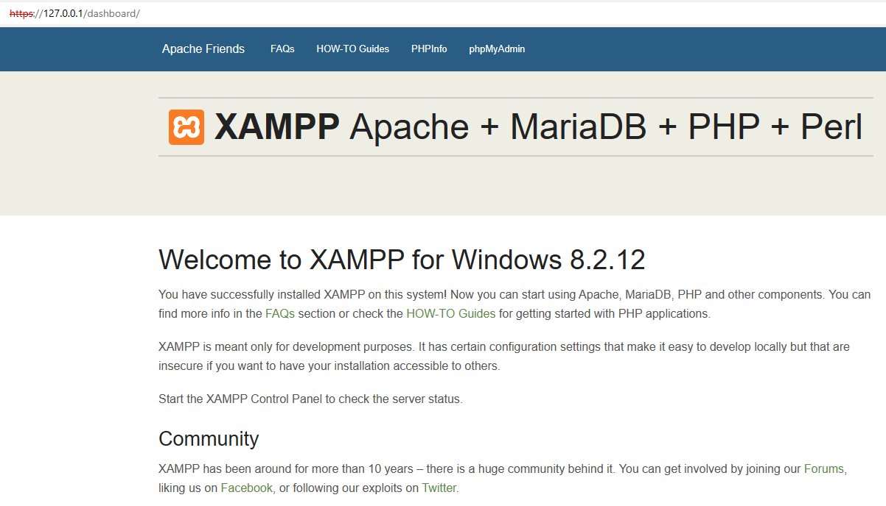
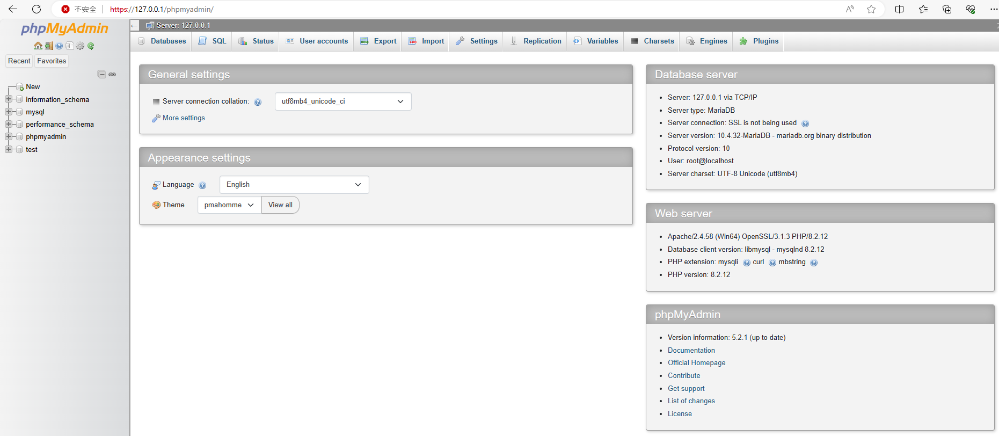

# XAMPP
- [安裝在Windows 11](XAMPP.md)
- [XAMPP 目錄結構](XAMPP_Directory.md)

# 安裝過程
# 啟動 ==> 參考XAMPP目錄結構
- [XAMPP目錄結構](XAMPP_Directory.md)
- 首頁及各類網站應用程式 ==> C:\xampp\htdocs



- 開啟之首頁
- https://127.0.0.1/dashboard/

  

- http://127.0.0.1/dashboard/phpinfo.php
  - phpinfo.php ==> 只有一行程式 ` <?php phpinfo(); ?> `
  

- 使用 PHP撰寫的Mysql 資料庫管理系統
- http://127.0.0.1/phpmyadmin/

   
## MYSQL 資料庫
- 更改MYLSQ資料庫密碼[Resetting MySQL Root Password with XAMPP on Localhost](https://stackoverflow.com/questions/24566453/resetting-mysql-root-password-with-xampp-on-localhost)
  - 檔案名稱 `C:\xampp\phpMyAdmin\config.inc.php `
  - 更改`$cfg['Servers'][$i]['password'] = 'KSU2024';`
  - 存檔後重啟MYSQL
  - 連線到 mysql 資料庫 
```
C:\xampp\mysql\bin>mysql -u root -p test
Enter password: *******
Welcome to the MariaDB monitor.  Commands end with ; or \g.
Your MariaDB connection id is 13
Server version: 10.4.32-MariaDB mariadb.org binary distribution

Copyright (c) 2000, 2018, Oracle, MariaDB Corporation Ab and others.

Type 'help;' or '\h' for help. Type '\c' to clear the current input statement.

MariaDB [test]>
```
## 更多mysql執行檔
- mysql執行檔 ==> `C:\xampp\mysql\bin`
  - [MySQL 教程](https://www.runoob.com/mysql/mysql-tutorial.html)
  - 👍mysql.exe (連線到mysql資料庫的客戶端程式)
    - [6.5.1 mysql — The MySQL Command-Line Client](https://dev.mysql.com/doc/refman/8.0/en/mysql.html) 
  - mysqladmin.exe
  - mysqlbinlog.exe
  - mysqlcheck.exe
  - 👍mysqld.exe(mysql資料庫伺服器程式)
  - 👍mysqldump.exe(備份&還原mysql資料庫指令)
    - [6.5.4 mysqldump — A Database Backup Program](https://dev.mysql.com/doc/refman/8.0/en/mysqldump.html)
    - [The Complete mysqldump Guide (with examples)](https://simplebackups.com/blog/the-complete-mysqldump-guide-with-examples/)
    - [[MySQL] Mysqldump 備份&還原資料庫 – 指令範例](https://code.yidas.com/mysqldump/)
  - mysqldumpslow.pl
  - mysqld_multi.pl
  - mysqlhotcopy.pl
  - 👍mysqlimport.exe
    - [6.5.5 mysqlimport — A Data Import Program](https://dev.mysql.com/doc/refman/8.0/en/mysqlimport.html) 
  - mysqlshow.exe
  - mysqlslap.exe
  - mysql_config.pl
  - mysql_convert_table_format.pl
  - mysql_install_db.exe
  - mysql_ldb.exe
  - mysql_plugin.exe
  - mysql_tzinfo_to_sql.exe
  - mysql_upgrade.exe
  - mysql_upgrade_service.exe
  - mysql_upgrade_wizard.exe 
# XAMPP
- https://klab.tw/2022/08/automatically-renew-lets-encrypt-https-credentials-using-apache-nginx-on-windows/
- 在Windows使用IIS、Apache、Nginx申請免費SSL/TLS憑證，自動從Let’s Encrypt更新
- https://httpd.apache.org/docs/2.4/
- https://www.cynet.com.tw/learning/apache/apachedoc.htm
- 鳥歌 https://dic.vbird.tw/linux_server/unit10.php
- https://www.cynet.com.tw/learning/apache/apachedoc.htm
