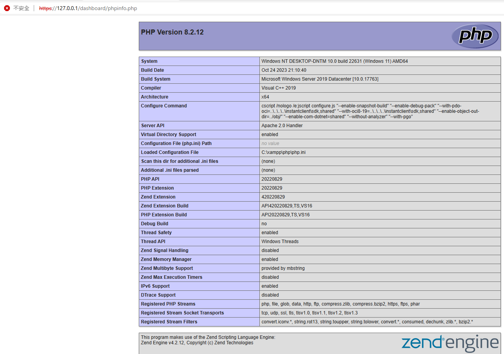

# XAMPP
- [安裝在Windows 11](XAMPP.md)
- [XAMPP 目錄結構](XAMPP_Directory.md)

# 安裝過程
# 啟動 ==> 參考XAMPP目錄結構
- [XAMPP目錄結構](XAMPP_Directory.md)
- 首頁及各類網站應用程式 ==> C:\xampp\htdocs

- 開啟之首頁
- https://127.0.0.1/dashboard/

  

- http://127.0.0.1/dashboard/phpinfo.php
  

- 使用 PHP撰寫的Mysql 資料庫管理系統
- http://127.0.0.1/phpmyadmin/

   

# XAMPP
- https://klab.tw/2022/08/automatically-renew-lets-encrypt-https-credentials-using-apache-nginx-on-windows/
- 在Windows使用IIS、Apache、Nginx申請免費SSL/TLS憑證，自動從Let’s Encrypt更新
- https://httpd.apache.org/docs/2.4/
- https://www.cynet.com.tw/learning/apache/apachedoc.htm
- 鳥歌 https://dic.vbird.tw/linux_server/unit10.php
- https://www.cynet.com.tw/learning/apache/apachedoc.htm
