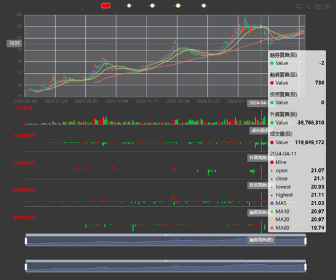

# FinMind
- [FinMind | 台灣金融市場53 種資料集](https://finmind.github.io/tutor/TaiwanMarket/DataList/)
- [FinMind|客製化看盤儀表板](https://finmind.github.io/tutor/analysis/CustomerDashboardWebServer/)
- [不錯的文件](https://finmind.github.io/)


## lab1
- Google Colab ==> !pip install FinMind==1.5.4

```python

import FinMind
from FinMind.data import DataLoader
from FinMind import plotting
print(FinMind.__version__)

stock_id = '00929'
start_date = '2018-01-01'
end_date = '2024-06-05'

data_loader = DataLoader()
stock_data = data_loader.taiwan_stock_daily(stock_id, start_date, end_date)
stock_data = data_loader.feature.add_kline_institutional_investors(
    stock_data
)
stock_data = data_loader.feature.add_kline_margin_purchase_short_sale(
    stock_data
)
# 繪製k線圖
kline_plot = plotting.kline(stock_data)
```


