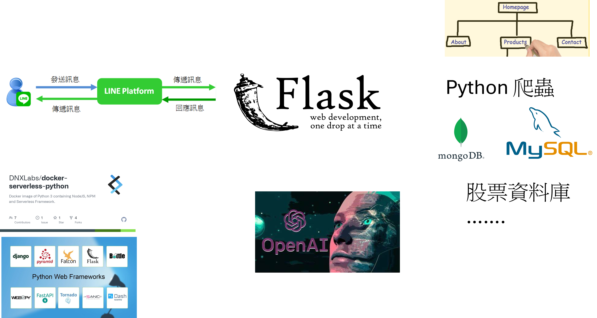

# 課程名稱: 專案開發---Python 程式
- Flask 網站伺服器程式開發
- Python 爬蟲
  - [Python 網路爬蟲：大數據擷取、清洗、儲存與分析 -- 王者歸來, 2/e |洪錦魁](https://www.tenlong.com.tw/products/9789860776478?list_name=srh)
  - 《Python3 网络爬虫开发实战（第二版）
    - https://cuiqingcai.com/17777.html
    - https://github.com/MyDearGreatTeacher/Python3WebSpider 
- Python 股票分析
  - [最強 AI 投資分析：打造自己的股市顧問機器人，股票趨勢分析×年報解讀×選股推薦×風險管理 | 施威銘研究室](https://www.tenlong.com.tw/products/9789863127727?list_name=srh)
  - https://www.flag.com.tw/bk/t/f3933
- Python 存取資料庫
  - Mysql
  - Mongodb 

# 專案架構

